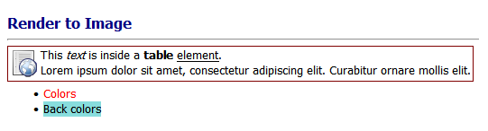
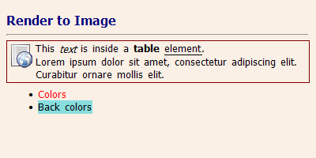
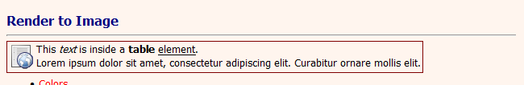
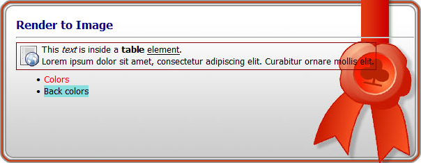
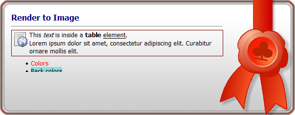
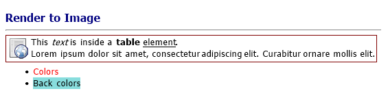
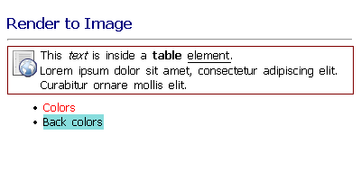
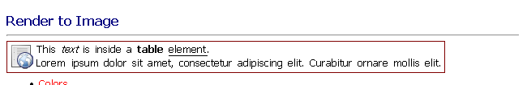
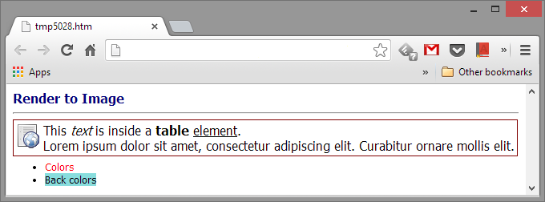
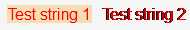

# Image Generation

## Generate image from HTML markup

HTML Renderer can be used to generate image (png, jpeg, bmp, etc.) from HTML markup snippet.  
Because of technical limitations, rendering to image requires special handling, this page goal is to provide all the tools required for successful and high-quality HTML image generation.  
For technical details see [GDI vs. GDI+ text rendering](#5-gdi-vs-gdi-text-rendering).  

When approaching image generation the most critical question is the generated image background, must the background have transparency (full or partial) or can it be completely filled by non-transparent color, be it solid color (like web-browsers white), gradient or existing image to render the HTML on it.
Therefor the page presents image rendering via 3 options: [solid color](#1-solid-color-background), [image](#2-image-background) and [transparent](#3-transparent-background) background.  

The second criteria is the generated image size: is it required to be of specific size, restricted by minimum and maximum values or free to be as large as the HTML requires.
In all cases, HTML layout is executed to find the rendered html desired size and to layout the HTML in the given restrictions.
Therefor each background rendering options has overloads to handle the different size restrictions.  

## 1. Solid color background

* Render HTML with solid background color.
* Using GDI text rendering.
* Excellent performance.
* Sharp and excellent aligned text.
* Using "HtmlRender.RenderToImage" methods.
* See the [HTML used in examples](#4-html-used-in-examples).

#### No size restrictions

``` csharp
Image image = HtmlRender.RenderToImage(html);
```

* The default background color is used - white.
* Generated image size depends on HTML content greedy layout.
    * Width will be set by the longest line without wrapping.
    * Height will be set by exact height of the HTML.



#### Fixed size image

``` csharp
Image image = HtmlRender.RenderToImage(html, new Size(400, 200), Color.Linen);
```

* Use `Color.Linen` solid background color.
* Generate image of fixed size - 400x200 pixels.
* HTML layout is restricted by max width - 400 pixels.
    * Text is wrapped to fit into the restricted width.
* Image heights extend beyond the actual height of the HTML.
    * If image height was smaller than actual HTML height the rendered HTML would be clipped.



#### Min/Max size restrictions

``` csharp
Image image = HtmlRender.RenderToImage(html, new Size(650, 50), new Size(1400, 106), Color.SeaShell);
```

* Generate image with minimum and maximum size restrictions.
* Restricted max width is above the max required width to layout the longest text without wrapping so it has no effect.
* Restricted min width is also above the required layout width (`541px`) therefore the html is extended.
* the resulting image width is 650px and the html uses the full width to layout.
* Restricted max height is lower than the required height to fully render the html therefore it is clipped at the restricted height value: 106px.



## 2. Image background

* Using GDI text rendering.
* Excellent performance.
* No new image object is created, the HTML is rendered on the given image object.
* Sharp and excellent aligned text.
* Using "HtmlRender.RenderToImage" methods.
* See the [HTML used in examples](#4-html-used-in-examples).

#### No explicit size restrictions

``` csharp
Image image = Image.FromFile("base.png");
HtmlRender.RenderToImage(image, html, new Point(15,10));
```

* HTML is rendered on top of the given background image.
* HTML is rendered at `(15, 10)` offset to better fit over the background image.
* HTML layout is restricted by image width.
    * Text is wrapped to fit into the restricted width.
* If image height was smaller than actual HTML height the rendered HTML would be clipped.



#### Explicit max size restriction

``` csharp
Image image = Image.FromFile("base.png");
HtmlRender.RenderToImage(image, html, new Point(15, 10), new Size(550, 120));
```

* HTML is rendered on top of the given background image.
* HTML is rendered at `(15, 10)` offset to better fit over the background image.
* HTML layout is restricted by given max-width.
    * Actual max height\width is also restricted by image size.
    * Text is wrapped to fit into the restricted width.
* HTML is clipped by the max height if cannot fit in.



## 3. Transparent background

* Render HTML with transparent background.
* Using GDI+ text rendering.
* [TextRenderingHint](https://learn.microsoft.com/en-us/dotnet/api/system.drawing.text.textrenderinghint) can be controlled, default: AntiAlias.
* Better used for high DPI devices like print.
* Less sharp and may have letter-symbols alignments small issues (font dependent).
* Slower than GDI (80%-150% slower, see [The wonders of text rendering and GDI](https://theartofdev.com/2013/08/12/the-wonders-of-text-rendering-and-gdi/)).
* Using `HtmlRender.RenderToImageGdiPlus` methods.
* See the [HTML used in examples](#4-html-used-in-examples).

#### No size restrictions with `AntiAlias` [TextRenderingHint](https://learn.microsoft.com/en-us/dotnet/api/system.drawing.text.textrenderinghint)

``` csharp
Image image = HtmlRender.RenderToImageGdiPlus(html);
```

* The image background is fully transparent.
* The default TextRenderingHint is used - `AntiAlias`.
* Rendered text is blurred a little by Anti-Aliasing (compared to GDI text rendering).
* Generated image size depends on HTML content greedy layout.
    * Width will be set by the longest line without wrapping.
    * Height will be set by exact height of the HTML.



#### Fixed size image with `AntiAliasGridFit` [TextRenderingHint](https://learn.microsoft.com/en-us/dotnet/api/system.drawing.text.textrenderinghint)

``` csharp
Image image = HtmlRender.RenderToImageGdiPlus(html, new Size(400, 200), TextRenderingHint.AntiAliasGridFit);
```

*   The image background is fully transparent.
*   Rendered text is not as smooth as GDI or non GridFit text rendering.
*   Generate image of fixed size - 400x200 pixels.
*   HTML layout is restricted by max width - 400 pixels.
    * Text is wrapped to fit into the restricted width.
*   Image heights extend beyond the actual height of the HTML.
    * If image height was smaller than actual HTML height the rendered HTML would be clipped.



#### Min/Max size restrictions with `SingleBitPerPixelGridFit` [TextRenderingHint](https://learn.microsoft.com/en-us/dotnet/api/system.drawing.text.textrenderinghint)

``` csharp
Image image = HtmlRender.RenderToImageGdiPlus(html, new Size(650, 50), new Size(1400, 106), TextRenderingHint.SingleBitPerPixelGridFit);
```

* The image background is fully transparent.
* Rendered text is not as smooth as GDI or non GridFit text rendering.
* Restricted max width is above the max required width to layout the longest text without wrapping so it has no effect.
* Restricted min width is also above the required layout width (541px) therefore the html is extended.
* the resulting image width is 650px and the html uses the full width to layout.
* Restricted max height is lower than the required height to fully render the html therefore it is clipped at the restricted height value: 106px.



## 4. HTML used in examples

#### HTML snippet

``` html
<body style="font: 10pt Tahoma">
    <h3 style="color: navy; margin-bottom: 8px">Render to Image</h3>
    <hr />
    <table style="border: 1px solid maroon; margin-top: 5px">
        <tr style="vertical-align: top;">
            <td width="32" style="padding: 2px 0 0 0">
                
            </td>
            <td>This <i>text</i> is inside a <b>table</b> <u>element</u>.<br />
                Lorem ipsum dolor sit amet, consectetur adipiscing elit. Curabitur ornare mollis elit.
            </td>
        </tr>
    </table>
    <ul style="margin-top: 5px">
        <li><span style="color: red">Colors</span></li>
        <li><span style="background-color: #8dd">Back colors</span></li>
    </ul>
</body>
```

#### Referenced image in the HTML snippet


#### Background Image used in [Generate image with image background](#2-image-background)


#### Expected result (as rendered in Google Chrome):



## 5. GDI vs. GDI+ text rendering

In a nutshell, GDI text rendering provides the best performance and visual quality.  

Reasons:

1. GDI+ is resolution independent, it may cause glyphs to increase in width tightening up the text.
2. The font hinting of GDI+ has lower quality than GDI, especially for lower sizes.
3. GDI+ is stateless in nature casing it to set and reset its context multiple times.

But GDI text rendering has two limitations:

1. Direct rendering to image device results in corrupted pixels.
2. Text rendering with transparent background results in corrupted pixels.

  

The first issue can be addressed by [Why text appears different when drawn with GDIPlus versus GDI](https://theartofdev.com/2013/10/24/transparent-text-rendering-with-gdi/).

* [ClearType](https://en.wikipedia.org/wiki/ClearType) on Wikipedia.
* [The wonders of text rendering and GDI](https://theartofdev.com/2013/08/12/the-wonders-of-text-rendering-and-gdi).
* [Text rendering methods comparison or GDI vs. GDI+ revised](https://theartofdev.com/2014/04/21/text-rendering-methods-comparison-or-gdi-vs-gdi-revised).
* [GDI text rendering to image](https://theartofdev.com/2014/01/12/gdi-text-rendering-to-image).
* [Transparent text rendering with GDI.](https://theartofdev.com/2013/10/24/transparent-text-rendering-with-gdi/)
