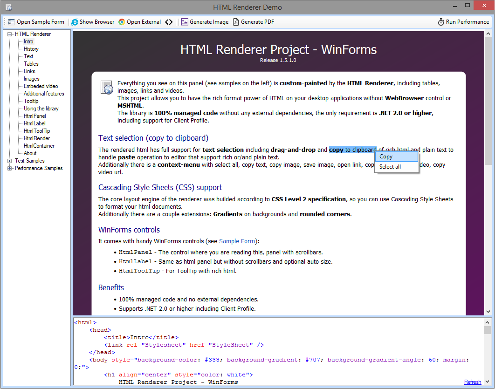

# HTML Renderer

Cross framework (WinForms/WPF/PDF/Metro/Mono/etc.), Multipurpose (UI Controls / Image generation / PDF generation / etc.), 100% managed (C#), High performance HTML Rendering library.

The library is 100% managed C# code without any external dependencies (no WebBrowser control, ActiveX / COM or MSHTML dll), the only requirement is .NET Framework 4.6.2 or higher.

